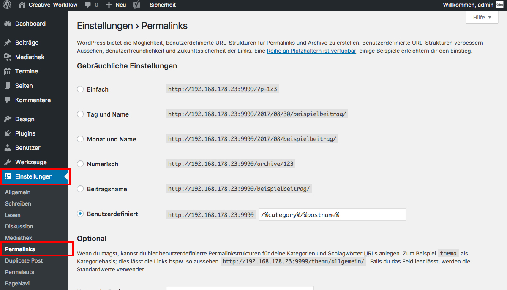

## Was ist ein Permalink?

Die Permalink-Struktur definiert, wie die URLs/Links zu einer Webseite aussehen. Idealerweise stehen in den URLs die Titel deiner Inhalte, um es den Suchmaschinen leichter zu machen.

Die Permalink-Einstellungen findest du unter "Einstellungen / Permalinks".

