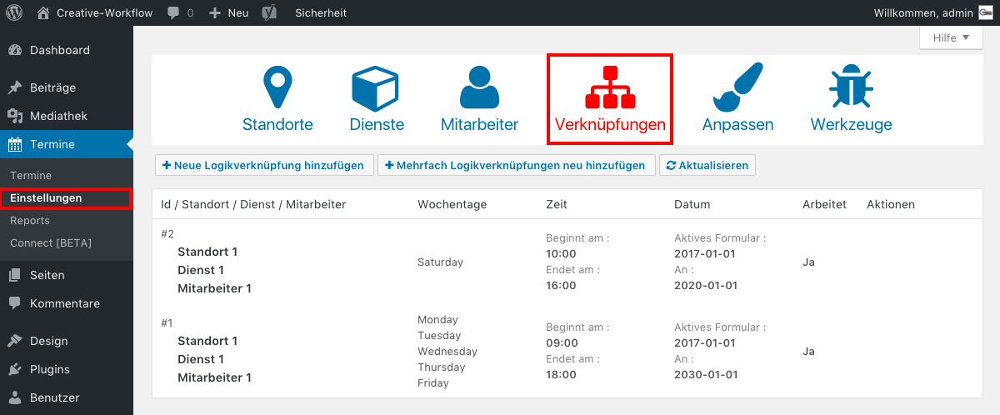

## Zeiträume bearbeiten *(1/4)*

Um die Zeiträume zu bearbeiten, klicke im Seitenmenü auf _**Termine/Einstellungen**_ und wähle das Tab _**Verknüpfungen**_.

Du siehst nun alle angelegten Zeiträume, in denen deine Kunden Termine buchen können.

