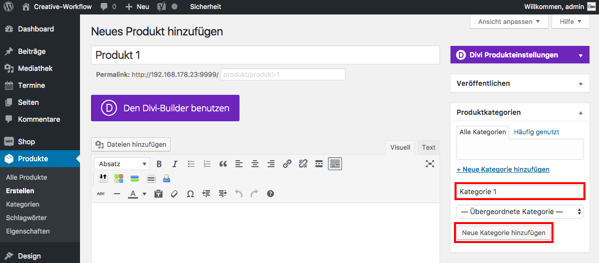

## Produktkategorie

Im Widget _**Produktkategorien**_ kannst du durch klicken auf _**Neue Kategorie hinzufügen**_ dein Produkt einer Kategorie zuordnen, um dann z.B. nur alle Produkte einer bestimmten Kategorie anzeigen zu lassen.

Klicke abschließend _**Neue Kategorie hinzufügen**_.

