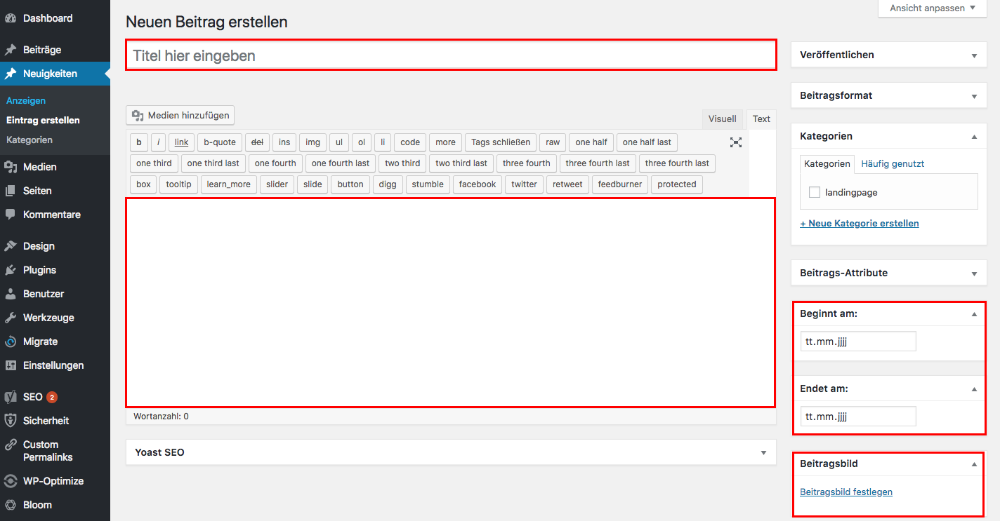

## Daten eingeben

Trage die benötigten Daten in die rot umrandeten Felder ein.

Weitere Informationen zum bearbeiten von Beiträgen findest du im Kapitel [Inhalt - bearbeiten](https://easy-presenter.github.io/easy-presenter/?repository=cw-wordpress-divi?presentation=./02_edit_content#/)

Kostenlose Bilder die auch kommerziell frei verwendet werden dürfen, kannst du z.B. hier finden: https://www.pexels.com.

