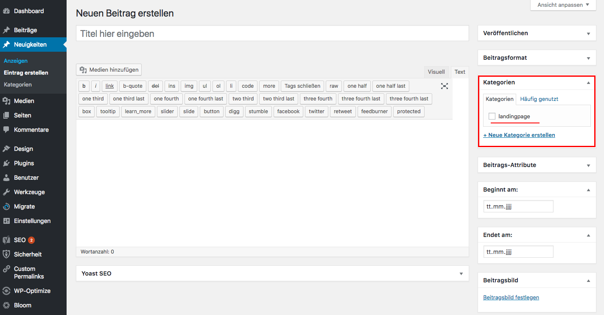

## Startseiten-Eintrag festlegen

Damit dein Eintrag auf der Startseite angezeigt wird wenn er aktiv ist, musst du das Häkchen _**landingpage**_ aktivieren.

Wenn du das getan hast, wird während des aktiven Zeitraumes die Nachricht auf der Startseite angezeigt.

