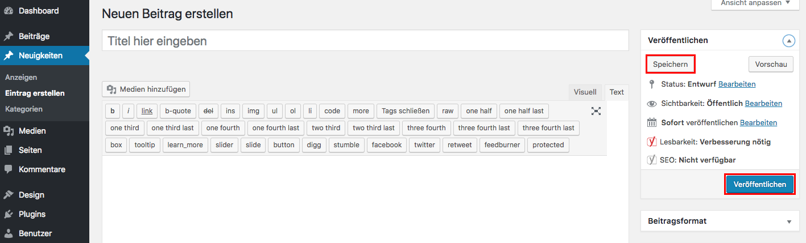

## Speichern

Klicke auf _**Speichern**_ (wenn du den Eintrag nur als Entwurf speichern möchtest) - oder auf _**Veröffentlichen**_ (wenn du den Eintrag publizieren möchtest).

Weitere Informationen zum Veröffentlichen findest du im Kapitel [Beiträge veröffentlichen](https://easy-presenter.github.io/easy-presenter/?repository=cw-wordpress-divi?presentation=./02_edit_content#/4).

