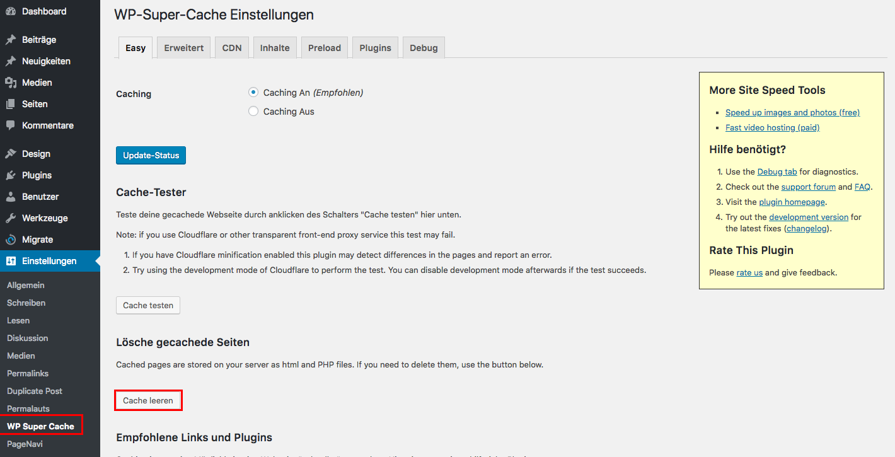

## Caching

Deine Website wird "gecacht", d.h. sie wird regelmässig zwischen gespeichert, damit sie schneller an deine Kunden ausgeliefert werden kann.

Durch das "caching" kann es passieren, dass die News-Einträge nicht sofort aktualisiert werden.

Um das zu beheben, muss du den cache löschen. Klicke dazu auf den Menüpunkt _**WP Super Cache**_ und anschließend  auf _**Cache Leeren**_.

