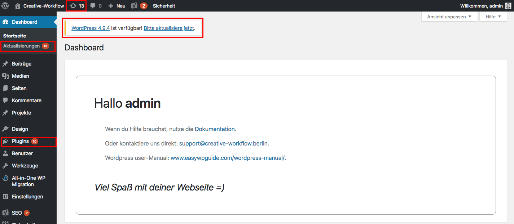

## Überblick

**Updates** sind Aktualisierungen der Software auf der deine Webseite basiert.

Updates gewährleisten, dass deine Webseite sicher vor Angriffen ist.

Wenn du dich einloggst, kannst du an den _**rot markierten**_ Stellen erkennen, wenn ein Update vorliegt.

