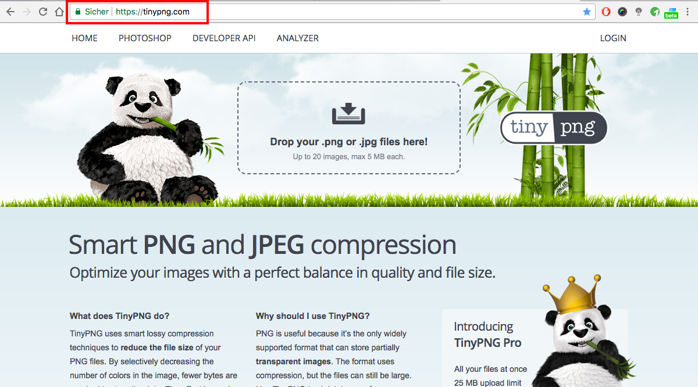

## Bilder-Optimierung (2/2)

Ein gutes kostenfreies Tool zum Optimieren der Dateigröße von Bilder ist z.B: https://tinypng.com.

Ziehe deine Bilder einfach mittels Drag&Drop auf die Seite und lade danach die komprimierte Version herunterladen.

