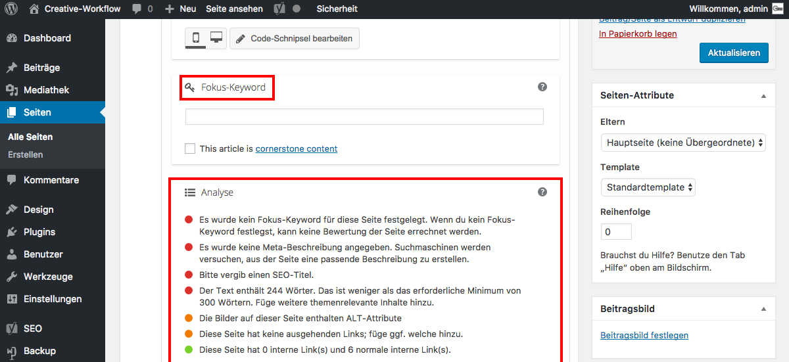

## Yoast SEO: Fokus-Keyword (3/5)

Der Abschnitt "Fokus-Keyword" dient nur dazu dir zu helfen, eine Seite auf das angegebene Keyword zu optimieren.

Der Abschnitt "Analyse" zeigt, wo noch Verbesserungspotential besteht.

