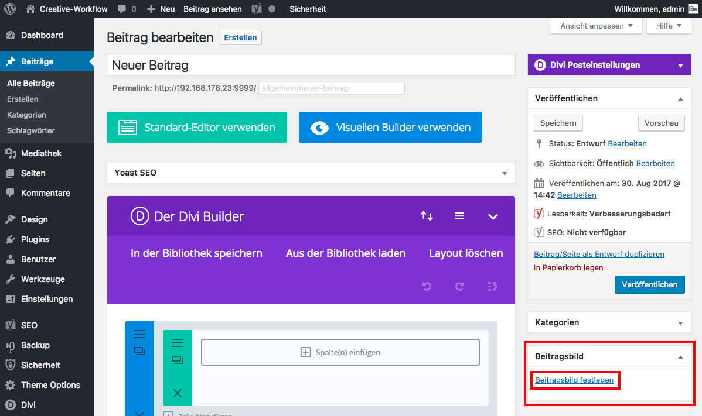

## Beitrag erstellen (3/4)

Wenn du für deinen Beitrag ein Beitragsbild festlegen möchtest, klicke im Widget "Beitragsbild" auf "Beitragsbild festlegen", wähle das Bild aus (falls noch nicht in der Mediathek dann per Drag&Drop hinzufügen) - und abschließend zum Speichern auf "Speichern".

