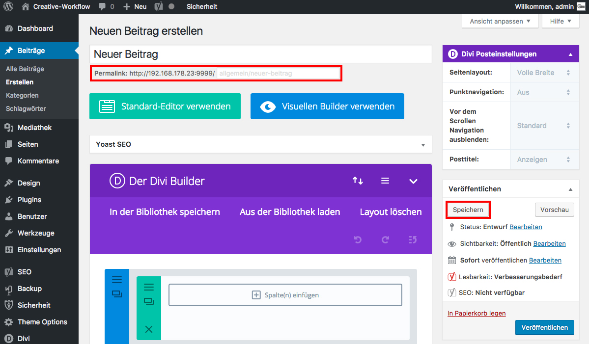

## Beitrag erstellen (4/4)

Wenn du jetzt auf "Speichern" klickst, wird dein Beitrag als Entwurf gespeichert.

### Anmerkung
Wenn der Beitrag einen Titel erhält, generiert Wordpress automatisch daraus einen Permalink (URL unter der der Beitrag angezeigt wird).
