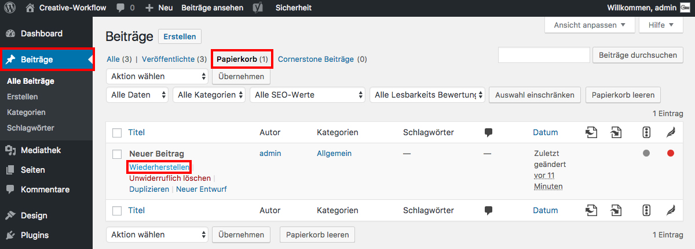

## Beitrag wiederherstellen

Um einen gelöschten Beitrag wiederherzustellen, navigiere im Seitenmenü zu "Beiträge" und klicke auf den Reiter "Papierkorb".

Wähle nun den Beitrag aus, den du wiederherstellen möchtest, halte den Mauszeiger darüber und klicke auf "Wiederherstellen".

