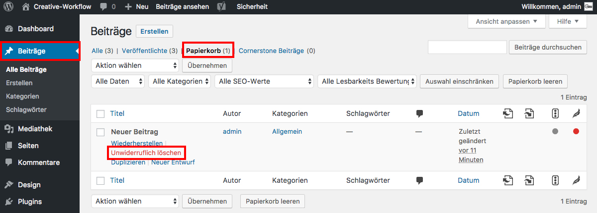

## Beitrag unwiderruflich löschen

Um einen gelöschten Beitrag unwiderruflich zu löschen, navigiere im Seitenmenü zu "Beiträge" und klicke auf den Reiter "Papierkorb".

Wähle nun den Beitrag aus, den du unwiderruflich löschen möchtest, halte den Mauszeiger darüber und klicke auf "Unwiderruflich löschen".

