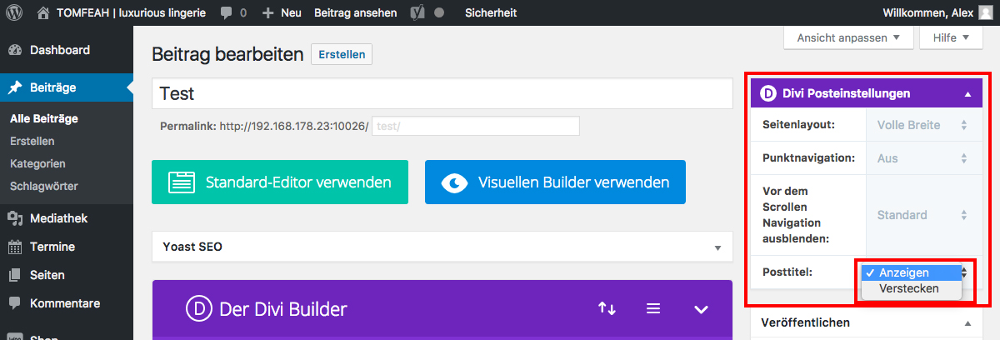

## Ein Module einfügen (2/6)

Sobald der Divi-Builder aktiviert wurde, verändert sich das Menü im Widget "Divi Posteinstellungen".

Z.B. kannst du die Beitragsüberschrift (Posttitel) "verstecken".

