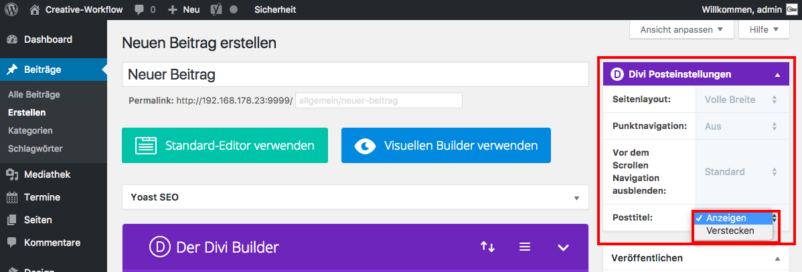

## Ein Module einfügen (2/4)

Sobald der Divi-Builder aktiviert wurde, verändert sich das Menü im Reiter "Divi Posteinstellungen".

Z.B. kannst du die Beitragsüberschrift (Posttitel) "verstecken".

