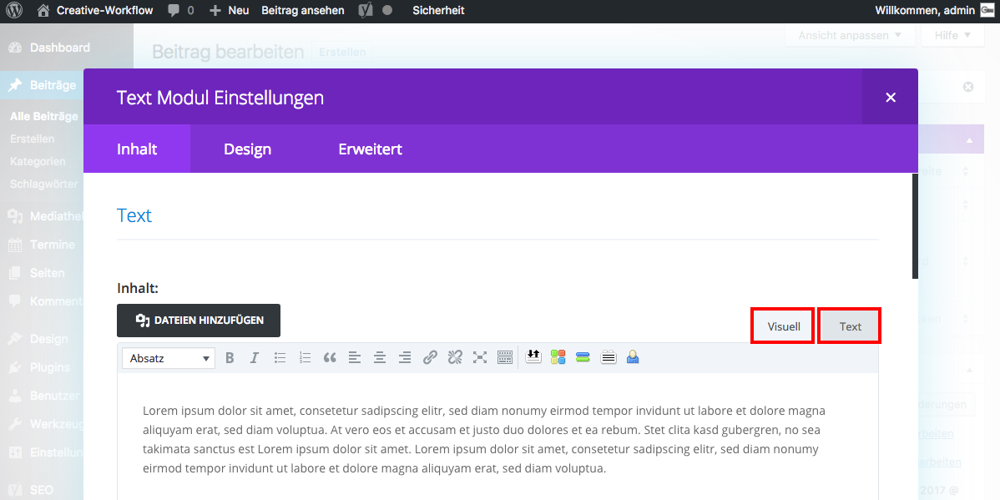

## WYSIWYG vs. Code

Im Text-Modul hast du die Möglichkeit Texte mittels eines WYSIWYG-Editor („what you see is what you get“) - Tab „Visuell“ - oder direkt durch Code-Eingabe im Tab „Text“ zu erstellen.

