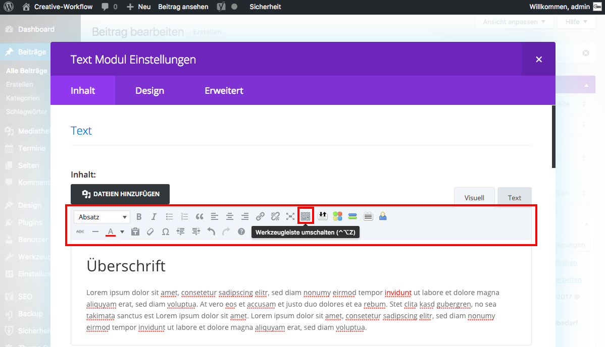

## WYSIWYG

Wählst du den WYSIWYG-Editor, kannst du Texte wie in gewöhnlichen Schreibprogrammen (Microsoft Word, OpenOffice Writer) mit Hilfe der Werkzeugleiste bearbeiten.

Hinweis: Falls nicht die gesamte Werkzeugleiste eingeblendet ist, klicke den Schalter „Werkzeugleiste umschalten“.

