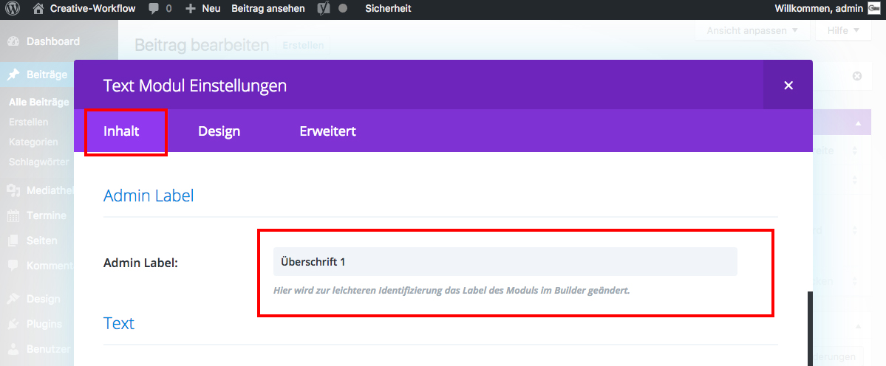

## Admin Label

Es ist sinnvoll, das Admin Label eines Moduls vernünftig zu benennen, um später in der erstellten Seite/Beitrag im Backend eine leichtere Identifizierung des jeweiligen Moduls zu ermöglichen.

Scrolle dazu im Tab „Inhalt“ zu dem Punkt „Admin Label“ und vergib einen Namen.

