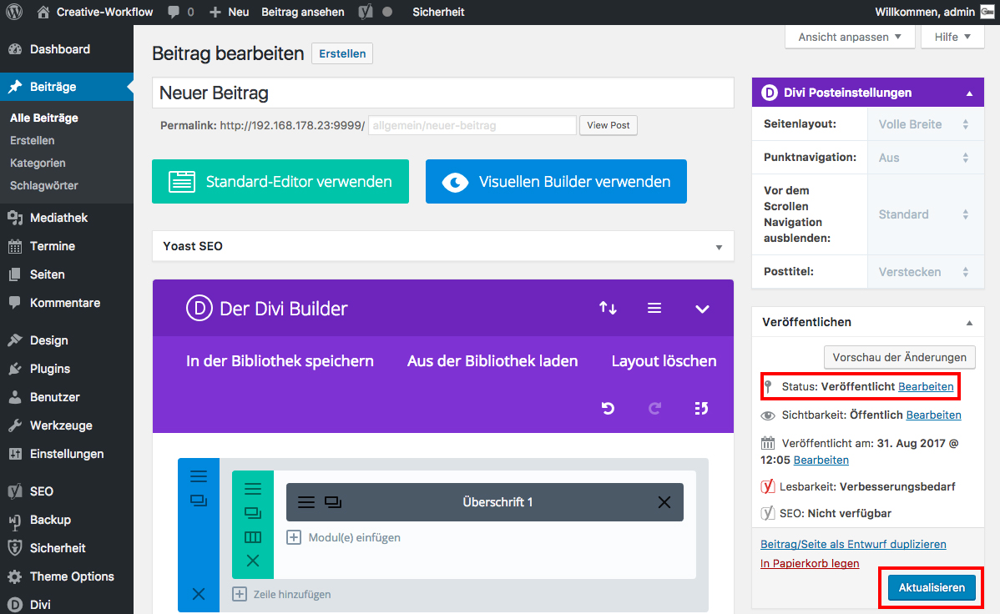

## Seite/Beitrag speichern

Vorher hast du die Änderungen im Text-Modul gespeichert, aber noch nicht die Änderung der Seite/ des Beitrages.

Klicke dazu auf "Aktualisieren" um die Seite/den Beitrag zu speichern.

