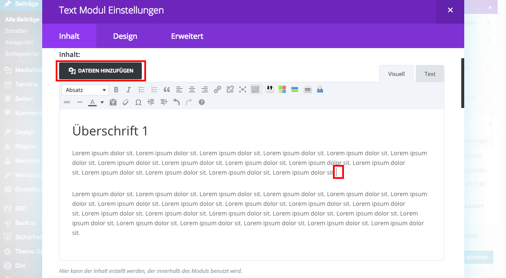

## Umfließen eines Bildes mit Text (1/2)

Willst du in deinen Text ein Bild einbinden das vom Text umflossen wird, klicke mit der Maus an die Stelle, wo du das Bild einfügen möchtest und anschließend auf „“Dateien hinzufügen.

