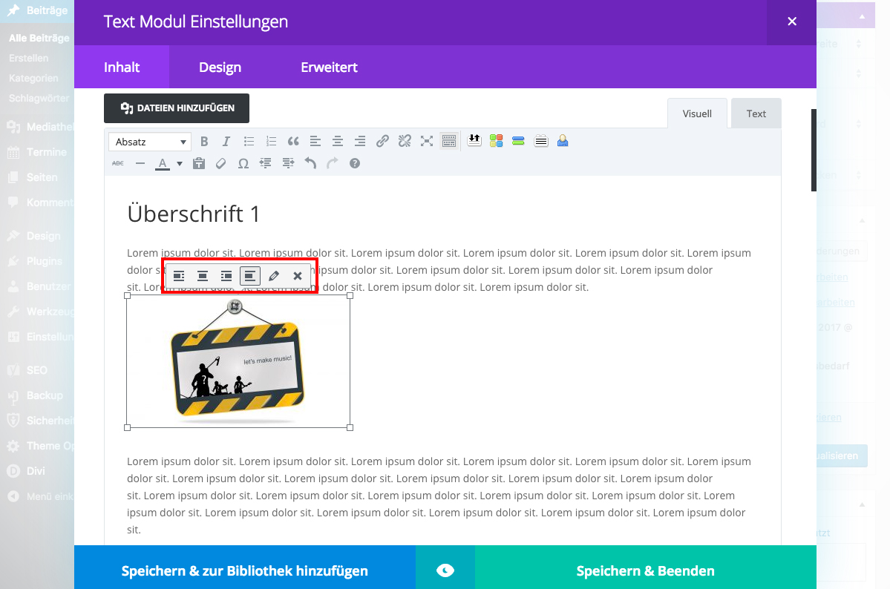

## Umfließen eines Bildes mit Text (2/2)

Wähle das gewünschte Bild aus deiner Mediathek und füge es in den Beitrag ein.

Klickst du nun auf das Bild erscheinen Optionen, mit denen du die Position des Bildes im Text bestimmen kannst.

