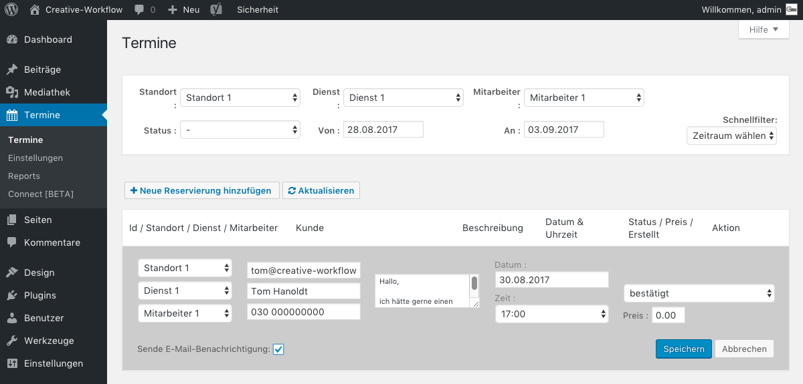

## Termin bearbeiten (2/3)

Nun kannst du den Termin bearbeiten und z.B. den Terminstatus von "unbestätigt" auf "bestätigt" ändern.

Sobald einer deiner Kunden einen Terminvorschlag abschickt, erhältst du allerdings auch eine E-Mail in der du den Termin direkt ablehnen oder annehmen kannst.

