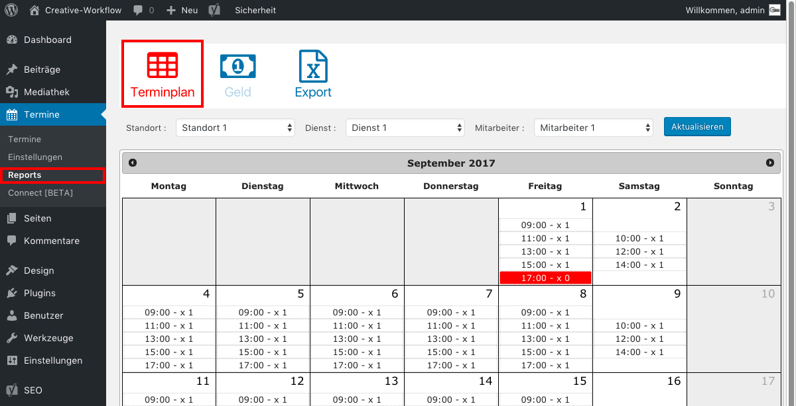

# Terminkalender Übersicht

Abgesehen davon, dass die Termine in deinem Google-Kalender sichtbar sind,
kannst du auch im Seitenmenü unter "Termine / Repots" unter dem Tab "Terminplan" alle deine Termine einsehen.

