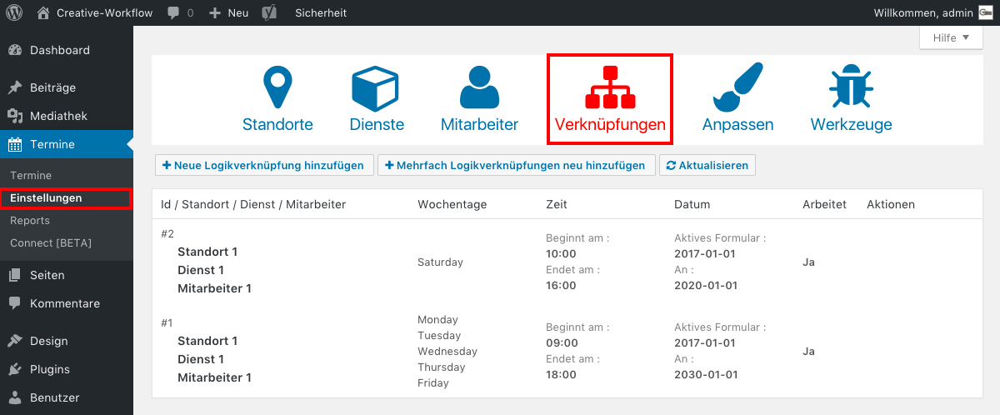

## Zeiträume bearbeiten (1/4)

Um die Zeiträume zu bearbeiten, klicke im Seitenmenü auf "Termine/Einstellungen" und wähle das Tab "Verknüpfungen".

Du siehst nun alle angelegten Zeiträume, in denen deine Kunden Termine buchen können.

