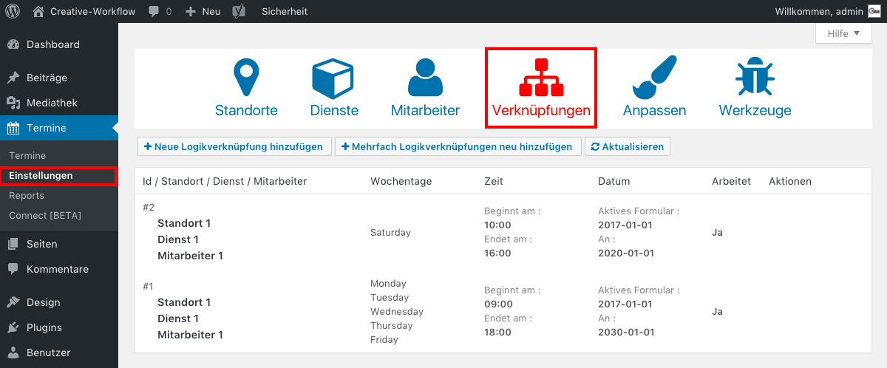

## Urlaub einstellen

Wenn du in einem bestimmten Zeitraum keine Termine zulassen möchtest, weil du verhindert bist, klicke im Seitenmenü auf "Termine / Einstellungen" und wähle das Tab "Verknüpfungen".

