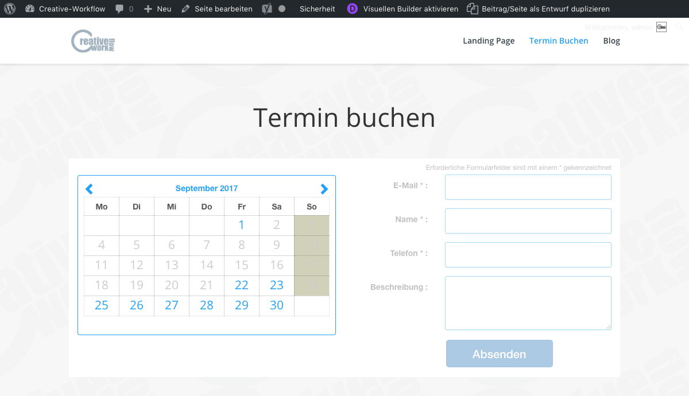

## Zeitraum überprüfen

Im Frontend kannst du nun auf der Terminbuchungs-Seite sehen, dass für den eingetragenen Zeitraum keine Termine gebucht werden können.

Wir wünschen dir einen schönen Urlaub =)

