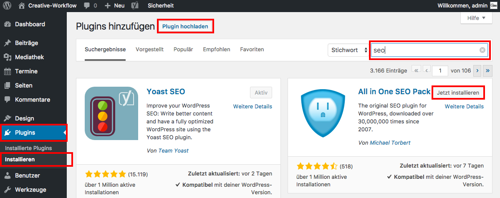

## Plugins installieren

Um ein Plugin zu installieren, navigiere im Seitenmenü zu "Plugins / Installieren".

Im Suchfenster kannst du das Plugin suchen, das du installieren möchtest. Klicke auf "Jetzt installieren" und danach auf "Aktivieren", damit der Funktionsumfang von Wordpress um das ausgewählte Plugin erweitert wird.

Wenn du ein Plugin manuell hochladen möchtest, klicke auf "Plugin hochladen" und danach auf "Aktivieren".

