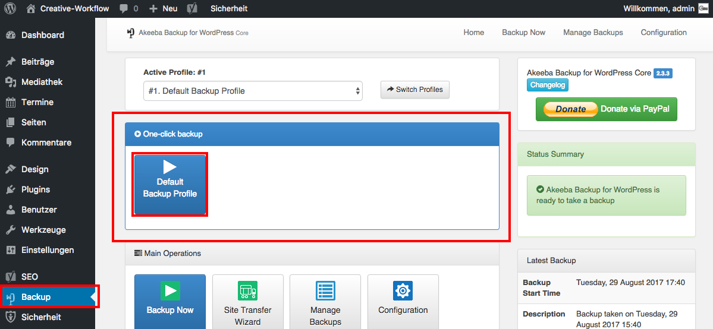

## Erstellung eines Backup? (1/2)

Navigiere im Seitenmenü zu „Backup“ und klicke im Widget "One-click backup" auf "Default Backup Profile".

Klickst du auf „Manage Backups“, sieht man eine Übersicht aller bisher angelegten Backups.
