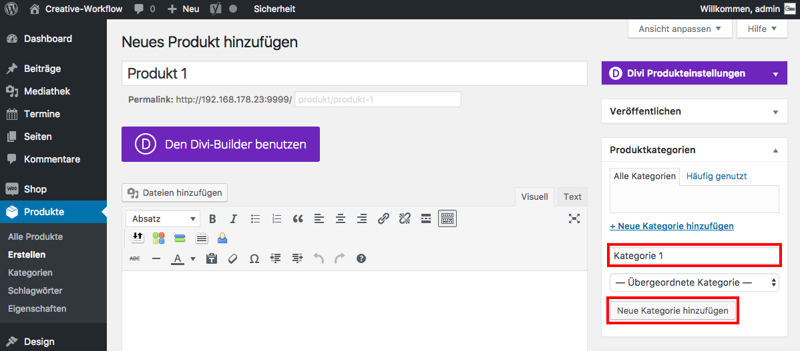

## Produktkategorie

Im Widget "Produktkategorien" kannst du durch klicken auf "Neue Kategorie hinzufügen" dein Produkt einer Kategorie zuordnen, um dann z.B. nur alle Produkte einer bestimmten Kategorie anzeigen zu lassen.
Klicke abschließend "Neue Kategorie hinzufügen".

