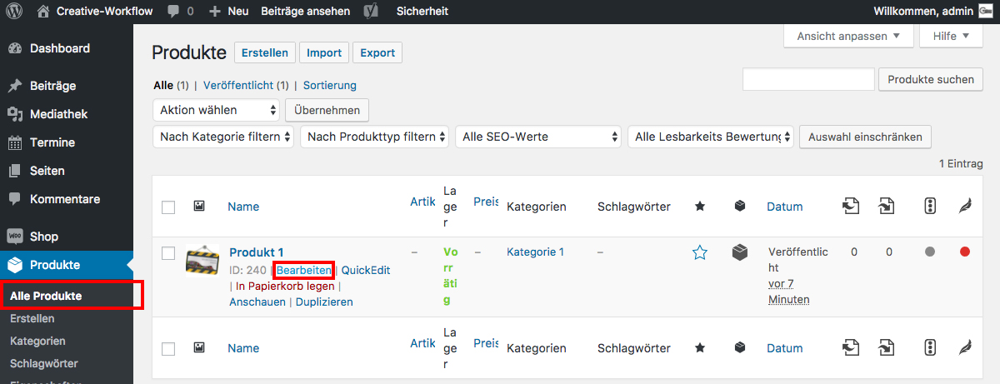

## Ein Produkt editieren

Klicke im Seitenmenü auf "Produkte / Alle Produkte" um einen Überblick über alle erstellten Produkte zu haben.
Halte die Maus über das Produkt das du editieren möchtest und klicke auf "Bearbeiten".

